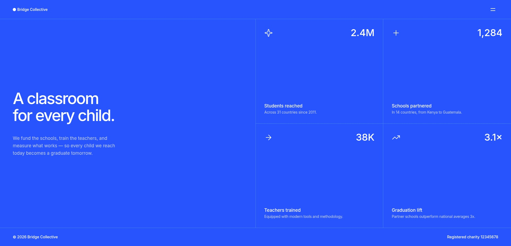

# Frontend Mentor - Grid landing page solution

This is a solution to
the [Grid landing page challenge on Frontend Mentor](https://www.frontendmentor.io/challenges/grid-landing-page).
Frontend Mentor challenges help you improve your coding skills by building realistic projects.

## Table of contents

- [Overview](#overview)
    - [The challenge](#the-challenge)
    - [Screenshot](#screenshot)
    - [Links](#links)
- [My process](#my-process)
    - [Built with](#built-with)
    - [What I learned](#what-i-learned)
    - [Continued development](#continued-development)
    - [Useful resources](#useful-resources)
    - [AI Collaboration](#ai-collaboration)
- [Author](#author)
- [Acknowledgments](#acknowledgments)

## Overview

### The challenge

Users should be able to:

- View the optimal layout for the page depending on their device's screen size
- See hover and focus states for all interactive elements on the page
- Open and close the navigation menu at any screen size using JavaScript
- Navigate the page with a keyboard and receive clear focus indicators

### Screenshot



### Links

- Solution URL: [GitHub](https://github.com/runny-life/grid-landing-page)
- Live Site URL: [GitHub Pages](https://runny-life.github.io/grid-landing-page/)

## My process

### Built with

- Semantic HTML5 markup
- SCSS / Sass with partials and BEM-like class naming
- CSS custom properties
- Flexbox
- CSS Grid
- Mobile-first workflow
- Vanilla JavaScript
- Vite for local development and build

### What I learned

During this project I improved my understanding of responsive layout, accessible navigation patterns, and scalable SCSS
architecture.

One of the most useful parts was creating a reusable `fluid()` function for responsive typography and spacing. It lets
values scale smoothly between mobile and desktop instead of relying on many separate media queries.

```scss
@function fluid($min, $max, $min-vw: 375px, $max-vw: 1440px) {
  $slope: math.div(strip-unit($max - $min), strip-unit($max-vw - $min-vw));
  $intercept: strip-unit($min) - $slope * strip-unit($min-vw);
  $preferred: calc(#{$intercept * 1px} + #{$slope * 100}vw);

  @return clamp(#{$min}, #{$preferred}, #{$max});
}
```

I also practiced building an accessible menu toggle with `aria-expanded`, `aria-controls`, and a JavaScript class
toggle.

```js
const onClickButtonElement = () => {
  let isExpanded = buttonElement.getAttribute("aria-expanded");

  buttonElement.setAttribute(
    "aria-expanded",
    isExpanded === "true" ? "false" : "true"
  );

  menuElement.classList.toggle("is-active");
  overlayElement.classList.toggle("is-active");
};

buttonElement.addEventListener("click", onClickButtonElement);
```

Another key learning was structuring the layout with CSS Grid and keeping borders consistent across responsive states.

```scss
.grid {
  display: grid;

  &--2-cols {
    @include desktop {
      grid-template-columns: repeat(2, 1fr);
    }
  }
}
```

### Continued development

In future iterations I would like to improve:

- Closing the menu with the `Escape` key
- Adding a focus trap while the menu is open
- Closing the menu when clicking outside of it
- Locking body scroll when the mobile menu is active
- Using `inert` or `aria-hidden` for background content when the menu is open
- Respecting `prefers-reduced-motion` for users who disable animations
- Handling menu state correctly on window resize
- Fixing minor ARIA reference details, such as matching `aria-describedby` with the correct element ID
- Renaming the `data-js-overay` attribute to `data-js-overlay`

### Useful resources

- [Frontend Mentor - Grid landing page challenge](https://www.frontendmentor.io/challenges/grid-landing-page) — the
  original challenge and design reference.
- [MDN Web Docs - aria-expanded](https://developer.mozilla.org/en-US/docs/Web/Accessibility/ARIA/Attributes/aria-expanded) —
  helped me implement the accessible menu toggle.
- [MDN Web Docs - clamp ()](https://developer.mozilla.org/en-US/docs/Web/CSS/clamp) — useful for fluid typography and
  spacing.
- [Sass Documentation](https://sass-lang.com/documentation/) — helped me organise the SCSS into base, components,
  layouts, and helpers.
- [Inter Font](https://rsms.me/inter/) — the typeface used in this project.

### AI Collaboration

I used an AI assistant for brainstorming the SCSS architecture, reviewing the accessible menu pattern, checking hover
and focus-visible states, and helping draft this README. All suggestions were reviewed, adapted, and tested manually
before being included in the project.

## Author

- GitHub - [GitHup profile](https://github.com/runny-life)
- Frontend Mentor - [@runny-life](https://www.frontendmentor.io/profile/runny-life)

## Acknowledgments

Thanks to Frontend Mentor for the challenge and to the creators of the Inter font. This project was built as part of a
Frontend Mentor learning path.